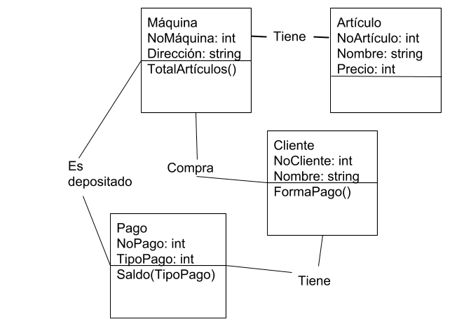

### **Tarea 1**
### **Unidad 1: Introducción al paradigma de la programación orientado a objetos.**
#### Conceptos:
#### _1. Paradigma._
####    _Es la forma en como alguien resuelve una problemática, por ejemplo paradigma de programación hace          referencia a como un programador (o programadores), soluciona a un problema o más de un                    problema._ 
####    _Hay diversos paradigmas de programación._

#### 2. Abstracción
####    En programación orientada a ojetos, abstracción es el conjunto de características específicas que          posee un objeto, y las cuales lo diferencian de otros tipos de objetos, además definen límites             conceptuales respecto a quien está haciendo alguna abstracción del objeto.

####    Ejemplos de abstracción
####    Ejemplo 1: ¿Qué características podemos abstraer de los automóviles? o ¿Qué características                semejantes tienen todos los automóviles?
####    Características: Marca, Modelo, Número de chasis, Peso llantas o cauchos, Puertas, Ventanas...             Comportamiento: Acelerar, Frenar, Retroceder...

####    Ejemplo 2: La gerencia de un taller mecánico necesita un sistema para controlar los vehículos que          ingresan a sus instalaciones. En este caso, las características esenciales de la clase Vehículo            son: marca, modelo, color, falla_detectada, nombre_propietario, dirección_propietario,                     teléfono_propietario...

#### 3. ¿Por qué decimos que la Clase es el mecanismo de abstracción de los lenguajes OO? 
####     Porque la clase es una base que se usa para definir cualquier objeto.

#### 4. Encapsulamiento.
####    Sirve para evitar una posible modificación indeseada de parte de los usuarios, ya que en                   programación se utiliza para ocultar.

Televisión sin encapsulamiento

Televisión con encapsulamiento

####    Definitivamente el encapsulamiento es muy útil, porque el usuario no puede cambiar el estado de            un ojeto desde la implementación, sino desde la interfaz.

#### 5. Herencia.
####    Cuando una clase es creada a partir de una clase existente. La herencia viene del hecho de que la          subclase tiene los atributos y métodos de la clase primaria.

#### UML: Lenguaje de Modelado Unificado.
#### 1. El lenguaje UML comenzó a gestarse en octubre de 1994, cuando Rumbaugh se unió a la compañía               Rational      fundada por Booch (dos reputados investigadores en el área de metodología del                software).
#### El objetivo de ambos era unificar dos métodos que habían desarrollado: el método Booch y el OMT            (Object Modelling Tool). El primer borrador apareció en octubre de 1995. En esa misma época otro           reputado investigador, Jacobson, se unió a Rational y se incluyeron ideas suyas. Estas tres personas       son conocidas como los “tres amigos”. Además, este lenguaje se abrió a la colaboración de otras            empresas para que aportaran sus ideas. Todas estas colaboraciones condujeron a la definición de la         primera versión de UML.

#### Es un lenguaje de modelado visual que se usa para especificar, visualizar, construir y documentar          artefactos de un sistema de software. Se usa para entender, diseñar, configurar, mantener y controlar      la información sobre los sistemas a construir.
#### UML capta la información sobre la estructura estática y el comportamiento dinámico de un sistema. Un       sistema se modela como una colección de objetos discretos que interactúan para realizar un trabajo         que finalmente beneficia a un usuario externo.

####  Las herramientas pueden ofrecer generadores de código de UML para una gran variedad de lenguaje de         programación, así como construir modelos por ingeniería inversa a partir de programas existentes.
#### TOP 5 DE HERRAMIENTAS UML:
#### MagicDraw
#### Papyrus UML
#### Modelio
#### ArgoUML
#### StarUML

#### Diagramas de Clases
#### Muestran un conjunto de clases, interfaces y colaboraciones, así como sus relaciones. Estos diagramas      son los más comunes en el modelado de sistemas orientados a objetos y cubren la vista de diseño            estática o la vista de procesos estática (sí incluyen clases activas).

#### ¿Sabes de alguna empresa local que utilice este lenguaje?
####  No

#### Máquina que vende cuadernos, lápices, plumas, borradores, sacapuntas y correctores

